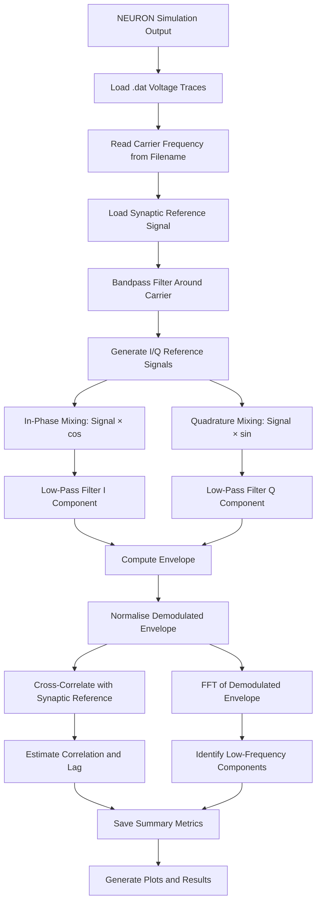

# 🧠 Modeling Signal Mixing Effects in Neurons using NEURON

This repository contains code for modelling **signal mixing effects in myelinated neurons** using the **NEURON simulator**, with post-processing in **MATLAB**.

The project investigates whether a biologically realistic neuron model can behave like a **non-linear electrical mixer** when stimulated by multiple alternating-current electrical signals. In electronics, non-linear circuits can mix two input frequencies and generate new frequency components. This project explores whether similar behaviour can occur in a neuron because voltage-gated ion channels are inherently non-linear.

---

## 📡 1. Signal Mixing

**Signal mixing** is the process where two signals of different frequencies interact inside a **non-linear system**, producing new frequencies at the **sum** and **difference** of the original input frequencies.

If two input signals are applied, where the first input is $x_1(t)$ and the second input is $x_2(t)$, then:

$$
x_1(t) = A_1 \cos(2\pi f_1 t)
$$

and

$$
x_2(t) = A_2 \cos(2\pi f_2 t).
$$

The combined input signal is therefore:

$$
x(t)
=
A_1 \cos(2\pi f_1 t)
+
A_2 \cos(2\pi f_2 t).
$$

In a perfectly linear system, the output would only contain the original input frequencies, $f_1$ and $f_2$.

However, in a non-linear system, the output can contain additional frequency components. A general non-linear input-output relationship can be written as:

$$
y(t)
=
a_1 x(t)
+
a_2 x^2(t)
+
a_3 x^3(t)
+
\cdots .
$$

The second-order term is especially important for signal mixing:

$$
x^2(t)
=
\left[
A_1 \cos(2\pi f_1 t)
+
A_2 \cos(2\pi f_2 t)
\right]^2 .
$$

Expanding this expression gives a cross-product term:

$$
2 A_1 A_2
\cos(2\pi f_1 t)
\cos(2\pi f_2 t).
$$

Using the trigonometric identity:

$$
\cos(a)\cos(b)
=
\frac{1}{2}
\left[
\cos(a-b)
+
\cos(a+b)
\right],
$$

the cross-product becomes:

$$
A_1 A_2
\left[
\cos\left(2\pi(f_1-f_2)t\right)
+
\cos\left(2\pi(f_1+f_2)t\right)
\right].
$$

Therefore, the non-linear system produces a difference-frequency component:

$$
f_{\mathrm{difference}}
=
\left| f_1 - f_2 \right|,
$$

and a sum-frequency component:

$$
f_{\mathrm{sum}}
=
f_1 + f_2.
$$

This is the key idea behind this project: if a neuron behaves as a non-linear electrical system, then two applied electrical signals may mix and generate sum and difference frequency components.

---

## 🧠 2. Neurons as Electrical Circuits

A **neuron** is an electrically active biological cell. It receives signals through dendrites, integrates them in the soma, and transmits action potentials along the axon.

A simplified neuron contains:

- **Dendrites** — receive input signals.
- **Soma** — integrates electrical activity.
- **Axon hillock** — trigger region where action potentials begin.
- **Axon** — cable-like structure that transmits spikes.
- **Nodes of Ranvier** — active regions in a myelinated axon.
- **Myelin sheath** — insulating layer that increases conduction speed.

From a circuit-theory point of view, a neuron can be treated as a **distributed non-linear electrical cable**.

The membrane behaves like:

- A **capacitor**, because the lipid membrane stores charge.
- A **conductance network**, because ions flow through channels.
- A **voltage-source network**, because each ion has a reversal potential.
- A **non-linear device**, because ion-channel conductances depend on voltage.

The membrane voltage dynamics can be written as:

$$
C_m \frac{dV_m}{dt}
=
-I_{\mathrm{ion}}
+
I_{\mathrm{stim}}.
$$

where:

- $C_m$ is the membrane capacitance.
- $V_m$ is the membrane voltage.
- $I_{\mathrm{ion}}$ is the total ionic current.
- $I_{\mathrm{stim}}$ is the applied stimulation current or external field contribution.

The total ionic current is:

$$
I_{\mathrm{ion}}
=
I_{\mathrm{Na}}
+
I_{\mathrm{K}}
+
I_{\mathrm{L}}.
$$

The sodium current is:

$$
I_{\mathrm{Na}}
=
g_{\mathrm{Na}} m^3 h
\left(
V_m - E_{\mathrm{Na}}
\right).
$$

The potassium current is:

$$
I_{\mathrm{K}}
=
g_{\mathrm{K}} n^4
\left(
V_m - E_{\mathrm{K}}
\right).
$$

The leakage current is:

$$
I_{\mathrm{L}}
=
g_{\mathrm{L}}
\left(
V_m - E_{\mathrm{L}}
\right).
$$

Therefore, the full ionic-current expression is:

$$
I_{\mathrm{ion}}
=
g_{\mathrm{Na}} m^3 h
\left(
V_m - E_{\mathrm{Na}}
\right)
+
g_{\mathrm{K}} n^4
\left(
V_m - E_{\mathrm{K}}
\right)
+
g_{\mathrm{L}}
\left(
V_m - E_{\mathrm{L}}
\right).
$$

The sodium and potassium currents are non-linear because the gating variables $m$, $h$, and $n$ depend on voltage and appear as powers such as $m^3h$ and $n^4$.

---

## 🧩 3. Axon Hillock and Non-Linear Mixing

The **axon hillock** is the region where the soma connects to the axon. It is important because it is usually where action potentials are initiated.

The axon hillock is highly non-linear because it contains dense voltage-gated sodium and potassium channels. Small changes in membrane voltage can produce large changes in ionic current.

In circuit terms, the axon hillock can be compared to a non-linear electronic device such as:

- A diode
- A transistor
- A mixer
- A non-linear amplifier

The biological hypothesis of this project is:

> If endogenous and exogenous AC signals interact at a non-linear neuronal region such as the axon hillock, the neuron may generate new mixed-frequency components.

For two stimulation frequencies, $f_1$ and $f_2$, the expected mixed components are:

$$
f_{\mathrm{sum}}
=
f_1 + f_2
$$

and

$$
f_{\mathrm{difference}}
=
\left| f_1 - f_2 \right|.
$$

For example, if $f_1 = 5000 \ \mathrm{Hz}$ and $f_2 = 5003 \ \mathrm{Hz}$, then the difference frequency is:

$$
\left| f_2 - f_1 \right|
=
\left| 5003 - 5000 \right|
=
3 \ \mathrm{Hz}.
$$

So two high-frequency stimulation signals could theoretically generate a low-frequency envelope or difference-frequency response.

---

## 📷 4. Figures

### 🧠 Neuron Signal Mixing Model Diagram

<div align="center">
  
</div>

This figure shows the core idea of the project: endogenous and exogenous electrical signals are applied to a neuron model, and the resulting voltage response is analysed for mixed-frequency components.

---

### ⚡ Electronic Circuit Representation of Neuron

<div align="center">
  
</div>

This figure shows the neuron as an electrical circuit. The membrane capacitance, ionic conductances, axial resistance, and extracellular pathway together form a non-linear distributed electrical system.

---

## 🎯 5. Project Objective

The objective of this project is to test whether a biologically realistic neuron model can produce mixed-frequency components when stimulated by AC signals.

The workflow is:

1. Build a myelinated axon model in NEURON.
2. Apply endogenous and/or exogenous AC stimulation.
3. Record the membrane-voltage response.
4. Export voltage traces as data files.
5. Analyse the exported signals in MATLAB.
6. Use IQ demodulation, envelope extraction, cross-correlation, RMS, and FFT to check for recovered low-frequency components.

The expected evidence for signal mixing is the appearance of a frequency component close to $|f_1 - f_2|$.

---

## ▶️ 6. How to Use

### Step 1 — Clone the repository

```bash
git clone https://github.com/NumerousCryo123/Thesis.git
cd Thesis
```

### Step 2 — Go into the NEURON model folder

```bash
cd estimsurvey
```

### Step 3 — Compile the NEURON mechanisms

On Linux/macOS:

```bash
nrnivmodl
```

On Windows, use NEURON's `mknrndll` tool and select the `estimsurvey` folder.

This compiles the `.mod` files, which define the custom ion-channel and stimulation mechanisms used by the model.

### Step 4 — Launch the NEURON GUI

```bash
nrngui mosinit.hoc
```

The `mosinit.hoc` file opens a small GUI panel with different simulation options.

### Step 5 — Run a simulation

From the GUI, select one of the available options:

- **Endogenous only**
- **Exogenous only**
- **Endogenous and exogenous**
- **Node of Ranvier**

You can also manually load specific simulation files inside NEURON:

```hoc
load_file("initA.hoc")
```

```hoc
load_file("initB5.hoc")
```

```hoc
load_file("initB10.hoc")
```

### Step 6 — Export voltage traces

The NEURON model is used to generate membrane-voltage traces. These traces can be saved as `.dat` files and analysed in MATLAB.

Expected MATLAB data examples:

```text
Synapse_3Hz.dat
DBS_Suprathreshold_1000.dat
DBS_Suprathreshold_2000.dat
DBS_Suprathreshold_5000.dat
```

The DBS files should follow the pattern:

```text
DBS_Suprathreshold_<frequency>.dat
```

### Step 7 — Run MATLAB analysis

Open MATLAB and run:

```matlab
IQ Demodulator script in MATLAB
```

The MATLAB script loads the exported NEURON traces, demodulates them, extracts the envelope through a normalisation process, compares the recovered signal with a reference signal, and performs FFT analysis.

---

## 📄 7. Purpose of Each NEURON File

### `mosinit.hoc`

This is the main startup file for the NEURON project.

It loads the NEURON GUI and provides buttons for selecting different simulation cases. It exists so the project can be run from a simple interface instead of manually loading each script.

---

### `axon10.hoc`

This is the main myelinated axon model.

It defines the soma, nodes of Ranvier, internodes, geometry, extracellular mechanisms, passive internodal properties, and active nodal dynamics. This is the core biological model used to test whether a myelinated axon can generate mixed-frequency behaviour.

---

### `axon5.hoc`

This is an alternative axon model.

It exists to allow comparison with another axon configuration or an earlier model version without overwriting the main `axon10.hoc` model.

---

### `Neuron_Class.hoc`

This file defines the neuron using a reusable HOC template.

It exists to make the model more modular and object-oriented, so the neuron structure can be reused, extended, or instantiated more cleanly.

---

### `Node.hoc`

This file focuses on node-of-Ranvier behaviour.

Nodes of Ranvier are important because ion-channel activity is concentrated there. This file is useful for studying local non-linear membrane behaviour at the active regions of the myelinated axon.

---

### `initA.hoc`

This file runs an endogenous stimulation case.

It applies internally generated sinusoidal current stimulation using `IClamp` and records the voltage response. It exists to test how the neuron responds to internally applied electrical activity.

---

### `initA5.hoc`

This is an alternative endogenous stimulation setup.

It exists for testing different endogenous stimulation parameters or for keeping a separate experimental configuration.

---

### `initB5.hoc`

This file runs an exogenous two-frequency stimulation case.

It applies two close-frequency extracellular sine waves. This is important for testing whether the neuron can generate a low-frequency difference component through non-linear mixing.

For example, if $f_1 = 5000 \ \mathrm{Hz}$ and $f_2 = 5003 \ \mathrm{Hz}$, the expected difference frequency is:

$$
f_{\mathrm{difference}}
=
\left| f_2 - f_1 \right|
=
3 \ \mathrm{Hz}.
$$

This file is one of the key simulation cases for testing signal mixing.

---

### `initB10.hoc`

This file runs a combined endogenous and exogenous stimulation case.

It adds synaptic/endogenous activity and applies an extracellular sinusoidal field. It exists to test whether external AC stimulation can interact with endogenous neural activity through non-linear membrane dynamics.

---

### `protocolsA.hoc`

This file defines stimulation protocols.

It includes waveform logic for pulse, square-wave, and sine-wave stimulation cases. It exists to standardise stimulation experiments and threshold-testing conditions.

---

### `protocolsB.hoc`

This file defines additional stimulation protocols, especially for uniform gradient-field stimulation.

It exists so exogenous field stimulation can be tested systematically under different waveform and threshold conditions.

---

### `thresh4.hoc`

This file performs excitation-threshold detection.

It checks whether a simulation produces an action potential and uses binary search to estimate the stimulation amplitude required to reach threshold.

The basic idea is:

$$
\text{stimulus too low}
\rightarrow
\text{no spike},
$$

and

$$
\text{stimulus high enough}
\rightarrow
\text{spike}.
$$

The script searches between these cases until the threshold is estimated.

---

### `interpxyz.hoc`

This is a helper file for interpolation or spatial mapping.

It likely supports coordinate-dependent extracellular stimulation, where field values need to be mapped or interpolated along the axon.

---

### `THISFILE.hoc`

This is an additional simulation/testing script.

It likely stores an extra experimental configuration used during development, allowing tests to be run without changing the main simulation files.

---

### `Strengthen_Connections.hoc`

This file appears to be related to modifying connection or coupling parameters.

It exists to test how changing connection strength or coupling affects the neuron model.

---

### `AXNODE.mod`

This is a custom axon-node mechanism.

It supports nodal electrical behaviour in the axon model. Nodes of Ranvier require specialised active dynamics, so this mechanism helps define that behaviour.

---

### `fh.mod`

This file defines a Frankenhaeuser-Huxley-style ion-channel mechanism.

It is important because the project needs biologically realistic, non-linear sodium and potassium channel dynamics to test signal mixing.

---

### `fsquare.mod`

This file defines a square-wave stimulation mechanism.

It exists so the model can test pulse-based or biphasic stimulation protocols.

---

### `fzap.mod`

This file defines a ZAP or frequency-sweep stimulation mechanism.

It exists to test how the neuron responds across a range of stimulation frequencies.

---

### `xstim.mod`

This file defines an extracellular stimulation mechanism.

It exists because exogenous stimulation is central to the project. It allows external electric fields to be applied to the neuron model.

---

### `xtra.mod`

This file defines additional extracellular coupling support.

It couples extracellular potentials into the NEURON membrane equations, allowing external fields to influence the membrane voltage along the axon.

---

### `.ses` files

Session files include:

- `basicrig.ses`
- `modified_basicrig.ses`
- `varstep.ses`
- `vext_eext.ses`
- `vvsx.ses`

These files store NEURON GUI/session configurations such as graphs, panels, visualisation windows, and simulation layout settings. They exist to make it easier to reopen useful simulation views.

---

### `.dat` and `.txt` files

Data files include:

- `plottingdata.dat`
- `plottingdatan.dat`
- `d.txt`

These files store exported simulation data, plotting data, or intermediate outputs. They are useful for checking, plotting, or post-processing simulation results.

---

### Generated compiled files

Generated files include:

```text
*.c
*.o
nrnmech.dll
x86_64/
```

These files are created when NEURON compiles the `.mod` mechanism files. They are required for running compiled mechanisms but normally do not need to be edited manually.

---

## 🧮 8. MATLAB File Description

### `IQ Demodulator script in MATLAB`

This is the main MATLAB analysis file.

It exists because the NEURON model generates voltage traces, but MATLAB is used to perform signal-processing analysis and test whether low-frequency information can be recovered from high-frequency stimulation.

The MATLAB script performs:

- Loading of voltage traces exported from NEURON.
- Reading DBS stimulation files across different carrier frequencies.
- Loading a low-frequency synaptic reference signal.
- Bandpass filtering around the carrier frequency.
- IQ demodulation.
- Envelope extraction.
- Normalisation of recovered signals.
- Cross-correlation against the synaptic reference.
- Lag estimation.
- RMS analysis.
- FFT analysis of the demodulated envelope.
- Summary plotting across carrier frequencies.

The signal-processing pipeline is:

```text
NEURON voltage trace
        ↓
Bandpass filtering
        ↓
IQ demodulation
        ↓
Envelope extraction
        ↓
Normalisation
        ↓
Cross-correlation
        ↓
FFT analysis
        ↓
Summary plots and metrics
```

The main target is to detect whether the demodulated output contains a component near $|f_1 - f_2|$.

For example, if the stimulation frequencies are $f_1 = 5000 \ \mathrm{Hz}$ and $f_2 = 5003 \ \mathrm{Hz}$, then the expected recovered component is:

$$
f_{\mathrm{difference}}
=
\left| f_2 - f_1 \right|
=
3 \ \mathrm{Hz}.
$$

---

## 🔁 MATLAB Algorithm Diagram

The MATLAB script takes voltage traces exported from NEURON and processes them to determine whether low-frequency information can be recovered from high-frequency stimulation.



The purpose of the MATLAB algorithm is to test whether the demodulated voltage response contains a recovered component near the expected difference frequency:

$$
f_{\mathrm{difference}}
=
\left| f_1 - f_2 \right|.
$$

For example, if the applied stimulation frequencies are $f_1 = 5000 \ \mathrm{Hz}$ and $f_2 = 5003 \ \mathrm{Hz}$, then the expected recovered component is:

$$
f_{\mathrm{difference}}
=
3 \ \mathrm{Hz}.
$$

In simple terms, the MATLAB pipeline checks whether high-frequency neural stimulation contains a low-frequency envelope that matches the original reference activity.

---

## 📁 9. Project Tree

```text
Thesis/
│
├── README.md
├── LICENSE
├── IQ Demodulator script in MATLAB
│
└── estimsurvey/
    │
    ├── mosinit.hoc
    ├── axon10.hoc
    ├── axon5.hoc
    ├── Neuron_Class.hoc
    ├── Node.hoc
    │
    ├── initA.hoc
    ├── initA5.hoc
    ├── initB5.hoc
    ├── initB10.hoc
    ├── THISFILE.hoc
    ├── Strengthen_Connections.hoc
    │
    ├── protocolsA.hoc
    ├── protocolsB.hoc
    ├── thresh4.hoc
    ├── interpxyz.hoc
    │
    ├── AXNODE.mod
    ├── fh.mod
    ├── fsquare.mod
    ├── fzap.mod
    ├── xstim.mod
    ├── xtra.mod
    │
    ├── Fig1.png
    ├── screenshot2.png
    │
    ├── plottingdata.dat
    ├── plottingdatan.dat
    ├── d.txt
    │
    ├── basicrig.ses
    ├── modified_basicrig.ses
    ├── varstep.ses
    ├── vext_eext.ses
    ├── vvsx.ses
    │
    ├── AXNODE.c
    ├── AXNODE.o
    ├── fh.c
    ├── fh.o
    ├── fsquare.c
    ├── fsquare.o
    ├── fzap.c
    ├── fzap.o
    ├── xstim.c
    ├── xstim.o
    ├── xtra.c
    ├── xtra.o
    ├── mod_func.c
    ├── mod_func.o
    ├── nrnmech.dll
    │
    └── x86_64/
```

---

## ⚠️ Note

This is a computational modelling project. The results should be interpreted as simulation-based evidence of possible signal-mixing behaviour in a neuron model. Experimental biological validation would be needed to confirm whether the same effect occurs in real neurons.

---

## 👤 Author

**Arush Sinha**

MSc Analog and Digital Integrated Circuit Design  
Imperial College London

---

## 📜 License

See the `LICENSE` file for details.
