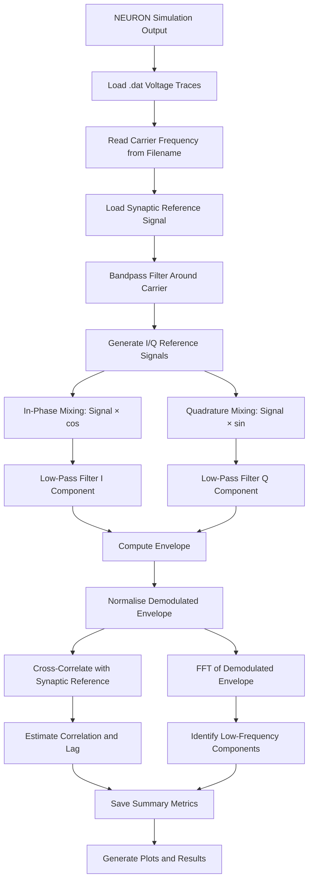

# 🧠 Modeling Signal Mixing Effects in Neurons using NEURON

This repository contains code for modelling **signal mixing effects in myelinated neurons** using the **NEURON simulator**, with post-processing in **MATLAB**.

The project investigates whether a biologically realistic neuron model can behave like a **non-linear electrical mixer** when stimulated by multiple alternating-current electrical signals. In electronics, non-linear circuits can mix two input frequencies and generate new frequency components. This project explores whether similar behaviour can occur in a neuron because voltage-gated ion channels are inherently non-linear.

---

## 📡 1. Signal Mixing

**Signal mixing** is the process where two signals of different frequencies interact inside a **non-linear system**, producing new frequencies at the **sum** and **difference** of the original input frequencies.

If two input signals are applied, where the first input is $x_1(t)$ and the second input is $x_2(t)$, then:

$$x_1(t) = A_1 \cos(2\pi f_1 t)$$

and

$$x_2(t) = A_2 \cos(2\pi f_2 t).$$

The combined input signal is therefore:

$$x(t) = A_1 \cos(2\pi f_1 t) + A_2 \cos(2\pi f_2 t).$$

In a perfectly linear system, the output would only contain the original input frequencies, $f_1$ and $f_2$. However, in a non-linear system, the output can contain additional frequency components. A general non-linear input-output relationship can be written as:

$$y(t) = a_1 x(t) + a_2 x^2(t) + a_3 x^3(t) + \cdots$$

The second-order term is especially important for signal mixing:

$$x^2(t) = \left[A_1 \cos(2\pi f_1 t) + A_2 \cos(2\pi f_2 t)\right]^2$$

Expanding this expression gives a cross-product term $2 A_1 A_2 \cos(2\pi f_1 t)\cos(2\pi f_2 t)$. Using the trigonometric identity:

$$\cos(a)\cos(b) = \frac{1}{2}\left[\cos(a-b) + \cos(a+b)\right],$$

the cross-product becomes:

$$A_1 A_2 \left[\cos\left(2\pi(f_1-f_2)t\right) + \cos\left(2\pi(f_1+f_2)t\right)\right].$$

Therefore, the non-linear system produces a difference-frequency component $f_{\mathrm{difference}} = |f_1 - f_2|$ and a sum-frequency component $f_{\mathrm{sum}} = f_1 + f_2$. This is the key idea behind this project: if a neuron behaves as a non-linear electrical system, then two applied electrical signals may mix and generate sum and difference frequency components.

---

## 🧠 2. Neurons as Electrical Circuits

A **neuron** is an electrically active biological cell. It receives signals through dendrites, integrates them in the soma, and transmits action potentials along the axon. A simplified neuron contains **dendrites** (receive input signals), a **soma** (integrates electrical activity), an **axon hillock** (trigger region where action potentials begin), an **axon** (cable-like structure that transmits spikes), **nodes of Ranvier** (active regions in a myelinated axon), and a **myelin sheath** (insulating layer that increases conduction speed).

From a circuit-theory point of view, a neuron can be treated as a **distributed non-linear electrical cable**. The membrane behaves like a capacitor (the lipid membrane stores charge), a conductance network (ions flow through channels), a voltage-source network (each ion has a reversal potential), and a non-linear device (ion-channel conductances depend on voltage).

The membrane voltage dynamics can be written as:

$$C_m \frac{dV_m}{dt} = -I_{\mathrm{ion}} + I_{\mathrm{stim}},$$

where $C_m$ is the membrane capacitance, $V_m$ is the membrane voltage, $I_{\mathrm{ion}}$ is the total ionic current, and $I_{\mathrm{stim}}$ is the applied stimulation current or external field contribution. The total ionic current is:

$$I_{\mathrm{ion}} = I_{\mathrm{Na}} + I_{\mathrm{K}} + I_{\mathrm{L}},$$

where the sodium, potassium, and leakage currents are:

$$I_{\mathrm{Na}} = g_{\mathrm{Na}} m^3 h \left(V_m - E_{\mathrm{Na}}\right), \qquad I_{\mathrm{K}} = g_{\mathrm{K}} n^4 \left(V_m - E_{\mathrm{K}}\right), \qquad I_{\mathrm{L}} = g_{\mathrm{L}} \left(V_m - E_{\mathrm{L}}\right).$$

Therefore the full expression is:

$$I_{\mathrm{ion}} = g_{\mathrm{Na}} m^3 h \left(V_m - E_{\mathrm{Na}}\right) + g_{\mathrm{K}} n^4 \left(V_m - E_{\mathrm{K}}\right) + g_{\mathrm{L}} \left(V_m - E_{\mathrm{L}}\right).$$

The sodium and potassium currents are non-linear because the gating variables $m$, $h$, and $n$ depend on voltage and appear as powers $m^3h$ and $n^4$.

---

## 🧩 3. Axon Hillock and Non-Linear Mixing

The **axon hillock** is the region where the soma connects to the axon and where action potentials are initiated. It is highly non-linear because it contains dense voltage-gated sodium and potassium channels — small changes in membrane voltage can produce large changes in ionic current. In circuit terms it can be compared to a diode, transistor, mixer, or non-linear amplifier.

The biological hypothesis of this project is:

> If endogenous and exogenous AC signals interact at a non-linear neuronal region such as the axon hillock, the neuron may generate new mixed-frequency components.

For two stimulation frequencies $f_1$ and $f_2$, the expected mixed components are $f_{\mathrm{sum}} = f_1 + f_2$ and $f_{\mathrm{difference}} = |f_1 - f_2|$. For example, if $f_1 = 5000\ \mathrm{Hz}$ and $f_2 = 5003\ \mathrm{Hz}$, then:

$$\left| f_2 - f_1 \right| = \left| 5003 - 5000 \right| = 3\ \mathrm{Hz}.$$

So two high-frequency stimulation signals could theoretically generate a low-frequency envelope or difference-frequency response.

---

## 📷 4. Figures

### 🧠 Neuron Signal Mixing Model Diagram

<div align="center">
  
</div>

This figure shows the core idea of the project: endogenous and exogenous electrical signals are applied to a neuron model, and the resulting voltage response is analysed for mixed-frequency components.

### ⚡ Electronic Circuit Representation of Neuron

<div align="center">
  
</div>

This figure shows the neuron as an electrical circuit. The membrane capacitance, ionic conductances, axial resistance, and extracellular pathway together form a non-linear distributed electrical system.

---

## 🎯 5. Project Objective

The objective of this project is to test whether a biologically realistic neuron model can produce mixed-frequency components when stimulated by AC signals. The workflow is: build a myelinated axon model in NEURON; apply endogenous and/or exogenous AC stimulation; record the membrane-voltage response; export voltage traces as data files; analyse the exported signals in MATLAB using IQ demodulation, envelope extraction, cross-correlation, RMS, and FFT to check for recovered low-frequency components. The expected evidence for signal mixing is the appearance of a frequency component close to $|f_1 - f_2|$.

---

## ▶️ 6. How to Use

Clone the repository with `git clone https://github.com/NumerousCryo123/Thesis.git` and enter the folder with `cd Thesis`. Then go into the NEURON model folder with `cd estimsurvey`. Compile the NEURON mechanisms with `nrnivmodl` on Linux/macOS, or use NEURON's `mknrndll` tool on Windows and select the `estimsurvey` folder. This compiles the `.mod` files which define the custom ion-channel and stimulation mechanisms. Launch the NEURON GUI with `nrngui mosinit.hoc`, which opens a panel with options for **Endogenous only**, **Exogenous only**, **Endogenous and exogenous**, and **Node of Ranvier**. You can also manually load simulation files inside NEURON using `load_file("initA.hoc")`, `load_file("initB5.hoc")`, or `load_file("initB10.hoc")`. The model generates membrane-voltage traces which can be saved as `.dat` files such as `Synapse_3Hz.dat`, `DBS_Suprathreshold_1000.dat`, `DBS_Suprathreshold_2000.dat`, and `DBS_Suprathreshold_5000.dat`. Finally, open MATLAB and run the IQ Demodulator script to load the exported traces, demodulate them, extract the envelope, compare the recovered signal with a reference, and perform FFT analysis.

---

## 📄 7. Purpose of Each NEURON File

**`mosinit.hoc`** — Main startup file. Loads the NEURON GUI and provides buttons for selecting different simulation cases. **`axon10.hoc`** — Main myelinated axon model. Defines the soma, nodes of Ranvier, internodes, geometry, extracellular mechanisms, passive internodal properties, and active nodal dynamics. **`axon5.hoc`** — Alternative axon model for comparison with a different configuration or earlier model version. **`Neuron_Class.hoc`** — Defines the neuron using a reusable HOC template, making the model more modular and object-oriented. **`Node.hoc`** — Focuses on node-of-Ranvier behaviour where ion-channel activity is concentrated. **`initA.hoc`** — Runs an endogenous stimulation case using `IClamp` sinusoidal current and records the voltage response. **`initA5.hoc`** — Alternative endogenous stimulation setup for testing different parameters. **`initB5.hoc`** — Runs an exogenous two-frequency stimulation case applying two close-frequency extracellular sine waves to test whether the neuron generates a difference-frequency component. **`initB10.hoc`** — Runs a combined endogenous and exogenous stimulation case, adding synaptic activity alongside an extracellular sinusoidal field. **`protocolsA.hoc`** — Defines stimulation protocols including pulse, square-wave, and sine-wave waveform logic. **`protocolsB.hoc`** — Defines additional protocols for uniform gradient-field stimulation. **`thresh4.hoc`** — Performs excitation-threshold detection using binary search to estimate the stimulation amplitude required to produce an action potential. **`interpxyz.hoc`** — Helper file for interpolation or spatial mapping supporting coordinate-dependent extracellular stimulation. **`THISFILE.hoc`** — Additional testing script storing an extra experimental configuration used during development. **`Strengthen_Connections.hoc`** — Tests how changing connection strength or coupling parameters affects the neuron model. **`AXNODE.mod`** — Custom axon-node mechanism supporting nodal electrical behaviour at the active regions of the myelinated axon. **`fh.mod`** — Frankenhaeuser-Huxley-style ion-channel mechanism providing biologically realistic non-linear sodium and potassium channel dynamics. **`fsquare.mod`** — Square-wave stimulation mechanism for pulse-based or biphasic protocols. **`fzap.mod`** — ZAP/frequency-sweep stimulation mechanism for testing neuron response across a range of frequencies. **`xstim.mod`** — Extracellular stimulation mechanism allowing external electric fields to be applied to the neuron model. **`xtra.mod`** — Additional extracellular coupling support, coupling external potentials into the NEURON membrane equations along the axon. **`.ses` files** (`basicrig.ses`, `modified_basicrig.ses`, `varstep.ses`, `vext_eext.ses`, `vvsx.ses`) — NEURON GUI session files storing graph layouts, panels, and visualisation window configurations. **`.dat` / `.txt` files** (`plottingdata.dat`, `plottingdatan.dat`, `d.txt`) — Exported simulation data and intermediate outputs. **Compiled files** (`*.c`, `*.o`, `nrnmech.dll`, `x86_64/`) — Generated automatically when NEURON compiles the `.mod` files. Do not edit manually.

---

## 🧮 8. MATLAB File Description

The main MATLAB script performs the full signal-processing pipeline on voltage traces exported from NEURON. It loads voltage traces, reads the carrier frequency from the filename, loads a low-frequency synaptic reference signal, bandpass filters around the carrier, generates in-phase and quadrature reference signals, mixes and low-pass filters to extract the I and Q components, computes the envelope, normalises, cross-correlates against the synaptic reference, estimates lag, runs FFT on the demodulated envelope, and produces summary plots and metrics. The main target is to detect whether the demodulated output contains a component near $|f_1 - f_2|$. For example, if $f_1 = 5000\ \mathrm{Hz}$ and $f_2 = 5003\ \mathrm{Hz}$, the expected recovered component is $f_{\mathrm{difference}} = |f_2 - f_1| = 3\ \mathrm{Hz}$.

---

## 🔁 9. MATLAB Algorithm Diagram



The pipeline checks whether high-frequency neural stimulation contains a low-frequency envelope matching the original reference activity, with the target component at $f_{\mathrm{difference}} = |f_1 - f_2|$.

---

## 📁 10. Project Tree

```text
Thesis/
│
├── README.md
├── LICENSE
├── IQ Demodulator script in MATLAB
│
└── estimsurvey/
    ├── mosinit.hoc
    ├── axon10.hoc
    ├── axon5.hoc
    ├── Neuron_Class.hoc
    ├── Node.hoc
    ├── initA.hoc
    ├── initA5.hoc
    ├── initB5.hoc
    ├── initB10.hoc
    ├── THISFILE.hoc
    ├── Strengthen_Connections.hoc
    ├── protocolsA.hoc
    ├── protocolsB.hoc
    ├── thresh4.hoc
    ├── interpxyz.hoc
    ├── AXNODE.mod
    ├── fh.mod
    ├── fsquare.mod
    ├── fzap.mod
    ├── xstim.mod
    ├── xtra.mod
    ├── Fig1.png
    ├── screenshot2.png
    ├── plottingdata.dat
    ├── plottingdatan.dat
    ├── d.txt
    ├── basicrig.ses
    ├── modified_basicrig.ses
    ├── varstep.ses
    ├── vext_eext.ses
    ├── vvsx.ses
    ├── AXNODE.c
    ├── AXNODE.o
    ├── fh.c
    ├── fh.o
    ├── fsquare.c
    ├── fsquare.o
    ├── fzap.c
    ├── fzap.o
    ├── xstim.c
    ├── xstim.o
    ├── xtra.c
    ├── xtra.o
    ├── mod_func.c
    ├── mod_func.o
    ├── nrnmech.dll
    └── x86_64/
```

---

## ⚠️ Note

This is a computational modelling project. The results should be interpreted as simulation-based evidence of possible signal-mixing behaviour in a neuron model. Experimental biological validation would be needed to confirm whether the same effect occurs in real neurons.

---

## 👤 Author

**Arush Sinha** — MSc Analog and Digital Integrated Circuit Design, Imperial College London

---

## 📜 License

See the `LICENSE` file for details.
